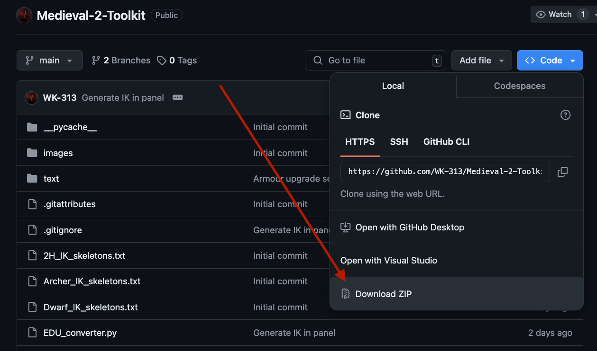

# Medieval 2: Total War - Blender Toolkit
This Blender addon provides a wide variety of tools to assist you in creating content for Medieval II: Total War

- [Medieval 2: Total War - Blender Toolkit](#medieval-2-total-war-blender-toolkit)
   * [Current Features](#current-features)
   * [Usage Instructions](#usage-instructions)
   * [Installation Instructions](#installation-instructions)
   * [Credits](#credits)

## Current Features
- Batch import units from an entire faction
- Import single units
- Batch import strategy .cas models
- Unit card renderer setup
- Unit variation randomizer

## [Usage Instructions](https://docs.google.com/document/d/1sjLq0buiZpiRU4AwekeG9lYVo7wYgm7mhbN25glYwIc)
For usage instructions, please refer to this [Google Doc](https://docs.google.com/document/d/1sjLq0buiZpiRU4AwekeG9lYVo7wYgm7mhbN25glYwIc)

## Installation Instructions

## Credits
- `WK | Kautto Ville`
    - Discord: `wk__`
