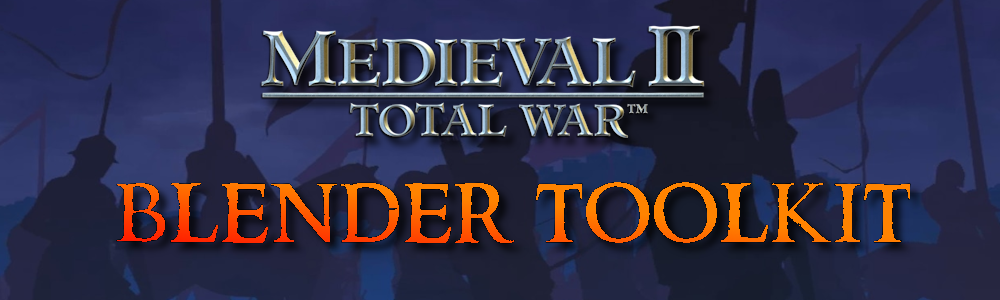
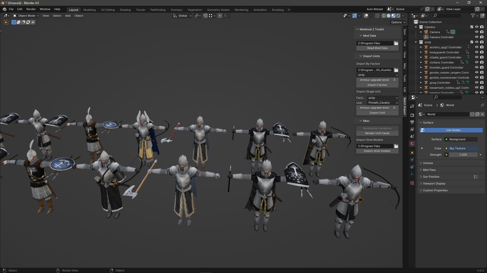
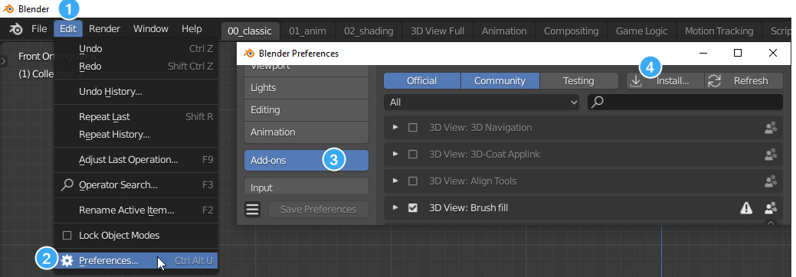
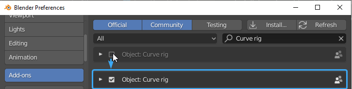

# Medieval 2: Total War - Blender Toolkit

This Blender addon provides a wide variety of tools to assist you in creating content for Medieval II: Total War

***

 

## Table of Contents
* [Features](#features)
* [Usage](#usage)
* [Installation](#installation)
* [Credits](#credits)

## Features
- Batch import units from an entire faction
- Import single units
- Batch import strategy .cas models
- Unit card renderer setup
- Unit variation randomizer

## [Usage](https://docs.google.com/document/d/1sjLq0buiZpiRU4AwekeG9lYVo7wYgm7mhbN25glYwIc)
For usage instructions, please refer to this [Google Doc](https://docs.google.com/document/d/1sjLq0buiZpiRU4AwekeG9lYVo7wYgm7mhbN25glYwIc)

## Installation

## 1. Download the release
Navigate to the [latest release](https://github.com/WK-313/Medieval-2-Toolkit/releases/latest) and download the zip file under the **Assets** section

## 2. Install the addon
Point it at the downloaded .zip file

## 3. Enable the addon
Enable `Medieval 2 Toolkit`

## Credits
- `WK | Kautto Ville`
    - Discord: `wk__`
